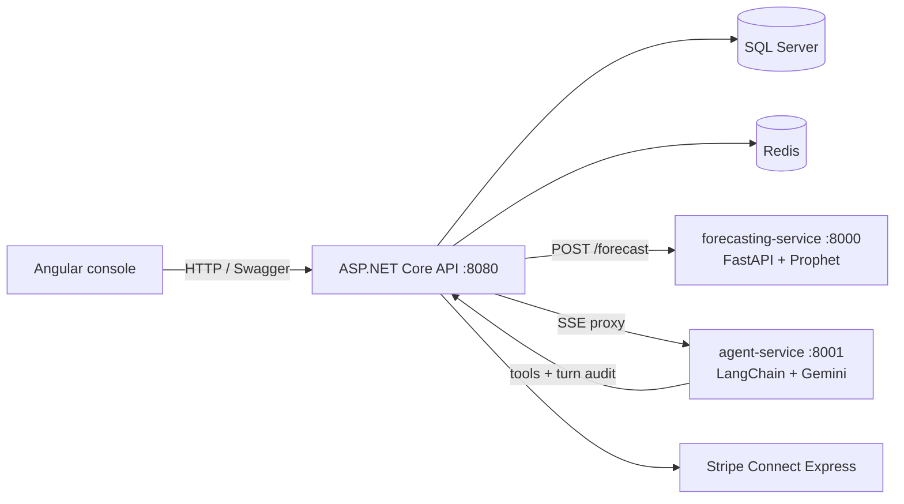
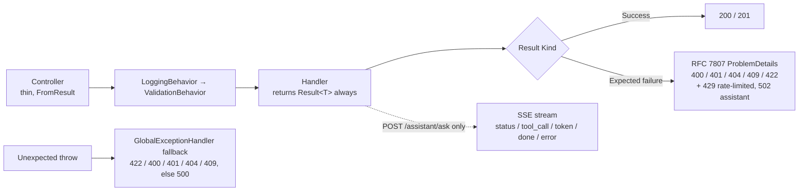
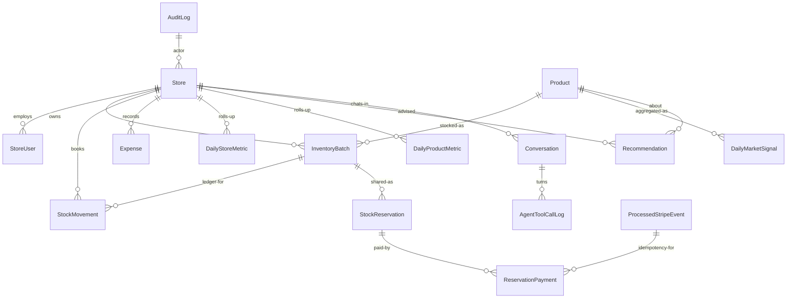

# StockMesh

StockMesh is a B2B inventory network for independent stores that operate in the same vertical — for example, neighborhood pharmacies or gaming shops.

Small stores face the same recurring problems: stockouts that lose sales, overstock that ties up cash and expires on the shelf, and demand signals that stay isolated inside each shop. Reordering is usually guesswork, and surplus in one store cannot easily reach a nearby store that needs it.

StockMesh solves this by combining private store management with a shared network. Each store manages its own products, batches, sales, and expenses. When a store has surplus, it shares batches to the vertical network where peers can discover, reserve, and receive them through a peer-to-peer transfer with payment. Every movement is recorded in an auditable ledger. On top of the operational flow, the platform forecasts demand to recommend when to reorder, share, or act on rising network demand, and provides a conversational assistant that answers questions grounded in the store's live data.

## Tech Stack

| Layer | Technology (as built) |
|---|---|
| API | .NET 10, ASP.NET Core, MediatR (CQRS), EF Core + SQL Server, ASP.NET Identity + self-managed JWT (HS256) |
| Cross-cutting | Serilog (request logging + `LogContext` correlation), Polly resilience, Swashbuckle (versioned `v1`, dev-only UI), custom `/health` checks |
| Forecasting service | Python FastAPI + Prophet (`POST /forecast`, `GET /health`) |
| Agent service | Python FastAPI + LangChain ReAct agent + Gemini, SSE frame stream |
| Coordination | Redis (reservation distributed lock, rate limiting), 3 .NET background sweepers |
| Payments | Stripe Connect Express (destination charges), DB-enforced webhook idempotency |
| Frontend | Angular 22 + Material, Tailwind, Chart.js (`Frontend/`, reference console) |
| Tests | xUnit (411 .NET tests), pytest suites in both Python services |

What is deliberately **not** here: no SignalR/push layer (the client reads over HTTP), no CORS profile on the API (the web client proxies `/api` and `/health` to the API in development).

## Project Structure

```
StockMesh.slnx
docker-compose.yml                  api + sqlserver + redis + forecasting-service + agent-service
Api/                            controllers (v1), Program.cs wiring, Swagger config
Application/                    MediatR commands/queries/validators/handlers, Result<T>, pipeline behaviors
Domain/                         entities, enums, exceptions
Infrastructure/                 EF Core, repositories, Redis lock, Stripe, assistant/forecasting clients, sweepers
Tests/                          Domain / Application / Infrastructure / Api.IntegrationTests
forecasting-service/            FastAPI + Prophet (main.py, forecasting.py)
agent-service/                  FastAPI SSE agent (main.py, agent.py, tools/)
Frontend/                  Angular store console
```

## Getting Started

Prereqs: .NET 10 SDK, Docker Desktop, Node 20+ (web client only), a Gemini API key (chatbot only).

```bash
docker compose up --build
```

| Service | URL |
|---|---|
| API / Swagger UI (Development) | `http://localhost:8080` → `/swagger` |
| Health | `http://localhost:8080/health` |
| Forecasting service | `http://localhost:8000` |
| Agent service | `http://localhost:8001` |
| Frontend | `ng serve` in `Frontend/` (proxies to the API) |

Configuration: copy `Api/appsettings.example.json` → `Api/appsettings.json` and `agent-service/.env.example` → `agent-service/.env`, then fill in your own connection string, Stripe keys (`SecretKey`, `WebhookSecret`), JWT secret (`JwtSettings:Key`), Gemini API key (`GEMINI_API_KEY`), and the shared internal key (`AgentLog:InternalKey` / `AGENT_INTERNAL_KEY` — must match).
In Docker Compose the API reads `Api/appsettings.json` and the agent reads `agent-service/.env` (see `docker-compose.yml:50`); locally the web proxy targets `http://localhost:5058`.

## Architecture

### Container topology



### Request pipeline



Conventions enforced in code: handlers never throw for expected outcomes (`Result<T>` with `FailureKind` is the only channel); the exception pipeline is a fallback for genuine bugs. The chatbot's SSE endpoint is the one deliberate exception — auth, validation, rate limit (10 questions/min/user), and agent outages all resolve as JSON *before* the first stream byte.

## Domain (ERD)



Ledger semantics: every sale, restock, and network transfer is a `StockMovement` row snapshotting price/cost at write time; `AuditLog` is append-only and every state change writes an entry in the same transaction.

## Design Notes

**Reservation lifecycle and concurrency.** Holds are created as `Pending` and move to `Accepted` then `Success` after payment; `Success` is system-only and written together with ledger entries. `Cancelled` is reachable from either side. Concurrent claims are serialized by a Redis distributed lock and guarded by a `row_version` concurrency token (conflicts return 409). Expired `Pending` holds are reaped every 60 seconds.

**Demand forecasting and recommendations.** The recommendation engine uses up to 180 days of per-store demand (requires at least 14 non-zero days) and requests up to 90 days of forecast. Decisions are: `Reorder` when projected demand over lead time exceeds stock on hand, `Share` when a sustained slump is detected, `UrgentShare`/`Share` when batches will expire before they sell, otherwise `Hold`.

**Market signal.** Daily reservation and transfer volumes per product are aggregated into `DailyMarketSignal` per vertical. When network demand shows a positive trend with at least 3 of the last 7 days above the forecast upper bound, the system creates `MarketOpportunity` recommendations.

**Forecasting engine.** The forecasting service decomposes each demand series into trend plus weekly and yearly seasonality and extrapolates with uncertainty bands (`yhat`, `yhat_lower`, `yhat_upper`). The API sends daily sales (or transfer volumes for market signals) and uses band width as a confidence signal. The service is a thin layer over `fit_forecast`.

**Conversational assistant.** A read-only ReAct agent answers store-scoped questions. The API validates, rate-limits (10/min), and assembles recent conversation history, then proxies the request to the agent service over SSE. The agent calls store-scoped tools (inventory, movements, recommendations, etc.) up to 5 times, streams `status`/`tool_call`/`token`/`done`/`error` frames, and writes a per-turn audit (`Conversation` + `AgentToolCallLog`) back to the API via an internal-key endpoint. Answers are grounded only in tool results.

## API Surface

Versioned (`/api/v1/...`), JWT Bearer (Swagger has the `Authorize` button wired):

| Prefix | Area |
|---|---|
| `/auth` | `register-store`, `login`, `join-store` (Owner-only), `refresh`, `logout` |
| `/stores`, `/products`, `/inventory` | stores, catalog, batches (add/update/share) |
| `/` (stock) | `RecordSale` / `RecordRestock` + movement ledger |
| `/network`, `/reservations` | shared-batch discovery, holds, accept/resolve |
| `/payments` | Connect onboarding, checkout sessions, Stripe webhook |
| `/dashboard`, `/expenses` | KPIs/trends, expense ledger |
| `/recommendations` | rule-layer output incl. `MarketOpportunity` |
| `/assistant` | `POST ask` (SSE), `GET conversations[/{id}]` |
| `/agent-logs` | internal turn-audit ingestion (agent key) |

Full request/response shapes: run the API in Development and open `/swagger`.
